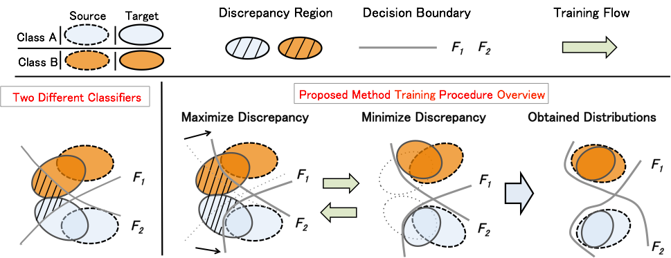

# Maximum Classifier Discrepancy for Domain Adaptation
This is the implementation of Maximum Classifier Discrepancy for digits classification and semantic segmentation in Pytorch.
The code is written by Kuniaki Saito. The work was accepted by CVPR 2018 Oral.
#### Maximum Classifier Discrepancy for Domain Adaptation: [[Project]]() [[Paper (arxiv)]]().

## Getting Started
### Installation
- Install PyTorch (Works on Version 0.2.0_3) and dependencies from http://pytorch.org.
- Due to the change of calculation of kl divergence, it may not work for newer version.
- Install Torch vision from the source.
- Install torchnet as follows
```
pip install git+https://github.com/pytorch/tnt.git@master
```
## Download Dataset
Download MNIST Dataset [here](). Resized image dataset is contained in the file.
Place it in the directory ./data.
SVHN Dataset and place it in !.
USPS dataset and place it in ~.

### ADR train/evaluation
For example, if you run an experiment on adaptation from svhn to mnist,
```
python main.py --source svhn --target mnist --num_k 3
```
, where num_k indicates the number of update for generator.
If you want to run an experiment using gradient reversal layer, simply add option --one_step when running this code.

## Citation
If you use this code for your research, please cite our papers (This will be updated when cvpr paper is publicized).
```
@article{saito2017maximum,
  title={Maximum Classifier Discrepancy for Unsupervised Domain Adaptation},
  author={Saito, Kuniaki and Watanabe, Kohei and Ushiku, Yoshitaka and Harada, Tatsuya},
  journal={arXiv preprint arXiv:1712.02560},
  year={2017}
}
```
