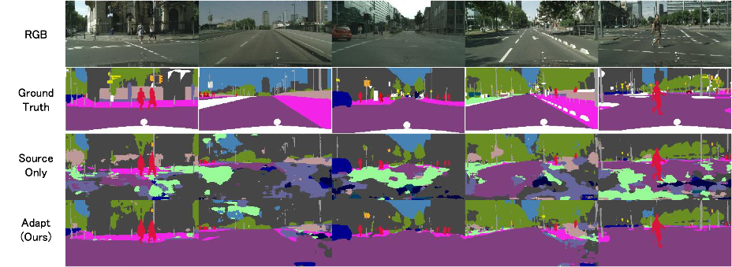

# Maximum Classifier Discrepancy for Domain Adaptation with Semantic Segmentation Implemented by PyTorch

  

***
## Installation
Use **Python 2.x**

First, you need to install PyTorch following [the official site instruction](http://pytorch.org/).

Next, please install the required libraries as follows;
```
pip install -r requirements.txt
```

## Usage
### Training
- Dataset
    - Source: GTA5 (gta), Target: Cityscapes (city)
- Network
    - Dilated Residual Network (drn_d_105)

We train the model following the assumptions above;
```
python adapt_trainer.py gta city --net drn_d_105
```
Trained models will be saved as "./train_output/gta-train2city-train_3ch/pth/normal-drn_d_105-res50-EPOCH.pth.tar"

### Test
```
python adapt_tester.py city ./train_output/gta-train2city-train_3ch/pth/normal-drn_d_105-res50-EPOCH.pth.tar
```

Results will be saved under "./test_output/gta-train2city-train_3ch---city-val/normal-drn_d_105-res50-EPOCH.tar"

<!-- 
#### CRF postprocessing
To use crf.py, you need to install pydensecrf. (https://github.com/lucasb-eyer/pydensecrf)

```
pip install git+https://github.com/lucasb-eyer/pydensecrf.git
```

After you ran adapt_tester, you can apply crf as follows;

For validation data
```
python crf.py ./outputs/YOUR_MODEL_NAME/prob crf_output --outimg_shape 2048 1024
```

For test data
```
python crf.py ./outputs/YOUR_MODEL_NAME/prob crf_output --outimg_shape 1280 720
```

Optionally you can use raw img as follows;
```
python crf.py outputs/spatial-adapt-g-0.001000-7/prob  outputs/spatial-adapt-g-0.001000-7/label_crf_rawimg --raw_img_indir /data/unagi0/watanabe/DomainAdaptation/Segmentation/VisDA2017/cityscapes_val_imgs
```

#### Visualize with Legend
After you ran adapt_tester, you can apply visualization_with_legend as follows;
```
python visualize_result.py --indir_list outputs/loss-weighted152-test-g-0.001000-k4-7/label/ outputs/psp04-test-g-0.001000-k4-9/label/ outputs/spatial-resnet101-testdata-g-0.001000-k4-11/label/ outputs/psp-test-g-0.001000-k4-28/label/ outputs/loss-weighted152-test-g-0.001000-k4-14/label --outdir merged
```


Results will be saved under "./outputs/YOUR_MODEL_NAME/vis_with_legend".
-->


### Evaluation
```
python eval.py city ./test_output/gta-train2city-train_3ch---city-val/normal-drn_d_105-res50-EPOCH.tar/label
```

## Reference codes
- https://github.com/Lextal/pspnet-pytorch
- https://github.com/fyu/drn
- https://github.com/meetshah1995/pytorch-semseg
- https://github.com/ycszen/pytorch-seg
